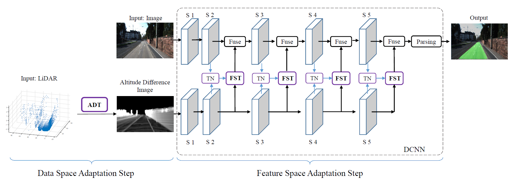

# PLARD 

[](https://github.com/zhechen/PLARD/LICENSE)
[](https://doi.org/10.1109/JAS.2019.1911459)


## Progressive LiDAR Adaptation for Road Detection Implemented in PyTorch

This repository reproduces the results of PLARD [PDF](https://arxiv.org/abs/1904.01206) in PyTorch. The code is heavily based on [pytorch-semseg](https://github.com/meetshah1995/pytorch-semseg).


<p align="center">

</p>

### Abstract

Despite rapid developments in visual image-based road detection, robustly identifying road areas in visual images remains challenging due to issues like illumination changes and blurry images. To this end, LiDAR sensor data can be incorporated to improve the visual image-based road detection, because LiDAR data is less susceptible to visual noises. However, the main difficulty in introducing LiDAR information into visual image-based road detection is that LiDAR data and its extracted features do not share the same space with the visual data and visual features. Such gaps in spaces may limit the benefits of LiDAR information for road detection. To overcome this issue, we introduce a novel Progressive LiDAR Adaptation-aided Road Detection (PLARD) approach to adapt LiDAR information into visual image-based road detection and improve detection performance. In PLARD, progressive LiDAR adaptation consists of two subsequent modules: 1) data space adaptation, which transforms the LiDAR data to the visual data space to align with the perspective view by applying altitude difference-based transformation; and 2) feature space adaptation, which adapts LiDAR features to visual features through a cascaded fusion structure. Comprehensive empirical studies on the well-known KITTI road detection benchmark demonstrate that PLARD takes advantage of both the visual and LiDAR information, achieving much more robust road detection even in challenging urban scenes. In particular, PLARD outperforms other state-of-the-art road detection models and is currently top of the publicly accessible benchmark leader-board.

### 22/02/2020 Update ###

1) I have double-checked my released model on my own environment: on the KITTI dataset, I have got maxF scores, **96.32/97.47/96.13/96.79**, for **UM/UMM/UU/URBAN**, respectively. This is similar to the reported ones in the paper. Note that the released model is trained independently from the model that produces the reported scores, thus there are some slight differences in the results. Also note that the released model does not produce lane detection results. 

2) The BEV-results I have obtained from my released model can be found [here](https://www.dropbox.com/s/e2tpn8s7jy05t43/plard.zip?dl=0). 

3) Since this project is developed based on an early version of [pytorch-semseg](https://github.com/meetshah1995/pytorch-semseg) and an old system, I am not sure what kinds of problems will appear in other environments. If you have code modification suggestions, please commit a pull request. 

4) I am sorry that the very original scripts for computing altitude difference images are lost. Please wait for my further update on this.

P.S. I am not updating this repository very frequently, so please forgive my late response in the future. 

### 19/08/2021 Update ###
1) I strongly recommend using our pre-trained model to initialize the network before training on any other tasks, even without LiDAR images.

2) For proper training with small batches, I tried to fix the batch normalization layers by default in codes.

### 23/07/2020 Update ###
Finally, I have got some time to re-implement the code for computing altitude difference image. The codes are written in MATLAB and are placed under the folder './codes-for-ADI'. Note that we re-tune the parameters for the new implementation, thus some parameters are different from the original implementation. This does not affect performance in practice.

### Installation ###
Please follow instructions on [pytorch-semseg](https://github.com/meetshah1995/pytorch-semseg).

### Setup

**Setup Dataset**

Please setup dataset according to the following folder structure:
```
PLARD
 |---- ptsemseg
 |---- imgs
 |---- outputs
 |---- dataset
 |    |---- training
 |    |    |---- image_2
 |    |    |---- ADI
 |    |---- testing
 |    |    |---- image_2
 |    |    |---- ADI 
```
The "image\_2" folders contain the visual images which can be downloaded from the [KITTI](http://www.cvlibs.net/datasets/kitti/eval_road.php).

The "ADI" folders contain the altitude difference images which can be downloaded [here](https://www.dropbox.com/s/wks807hv84wcduv/ADI-training.zip?dl=0) for training set and [here](https://www.dropbox.com/s/sslqw2flp7ptwnj/ADI-testing.zip?dl=0) for testing set. 

### Usage
**Test**

Run the test set on KITTI Road dataset using the following command:
```
python test.py --model_path /path/to/plard_kitti_road.pth
```
The results in perspective view will be written under "./outputs/results". Follow the guidelines of KITTI to perform evaluation. 

A trained model of PLARD can be downloaded [here](https://www.dropbox.com/s/lrtwhuo0rxv1sgy/plard_kitti_road.pth?dl=0). 

**Train**

Training script is similar to the [pytorch-semseg](https://github.com/meetshah1995/pytorch-semseg).

### Reference
**If you find this code useful in your research, please consider citing:**

```
@article{chen2019progressive,
  title={Progressive LiDAR adaptation for road detection},
  author={Chen, Zhe and Zhang, Jing and Tao, Dacheng},
  journal={IEEE/CAA Journal of Automatica Sinica},
  volume={6},
  number={3},
  pages={693--702},
  year={2019},
  publisher={IEEE}
}
```

